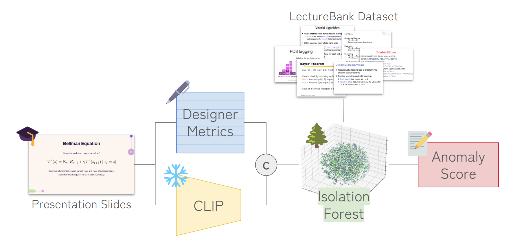

# Seeing Like a Designer Without One
**A Study on Unsupervised Slide Quality Assessment via Designer Cue Augmentation**

We present an unsupervised slide-quality assessment pipeline that combines seven expert-inspired visual-design metrics (whitespace, colorfulness, edge density, brightness contrast, text density, color harmony, layout balance) with CLIP-ViT embeddings, using Isolation Forest–based anomaly scoring to evaluted presentation slides. Trained on 12k professional lecture slides and evaluated on six academic talks (115 slides), our method achieved Pearson correlations up to 0.83 with human visual-quality ratings—1.79× to 3.23× stronger than scores from leading vision–language models (ChatGPT o4-mini-high, ChatGPT o3, Claude Sonnet 4, Gemini 2.5 Pro). Augmenting low-level design cues with multimodal embeddings closely approximates audience perceptions of slide quality, enabling scalable, objective feedback in real time.

 

## Key Features

- 🖊️ **Unsupervised** – Slide quality assessment without any human labels, which can be labor intensive and highly subjective. 
- 📈 **Correlation with Human Perception** – Validated via correlation with human evalutations.
- 🚀 **Lightweight** – Super lightweight algorithm. Evaluate your slides within a second.

## Model Overview

Our pipeline combines low-level slide design heuristics with high-level vision–language representations to produce a single, unsupervised quality score. Specifically, we extract seven interpretable design metrics from each slide image, embed the same image with CLIP, fuse the two representations through latent-space augmentation, and finally compute an anomaly score with isolation forest on a corpus of professional slides.

## Paper

Coming soon...

## Acknowledgement

This work was done under Mechanical Engineering Frontiers E at Waseda University.
